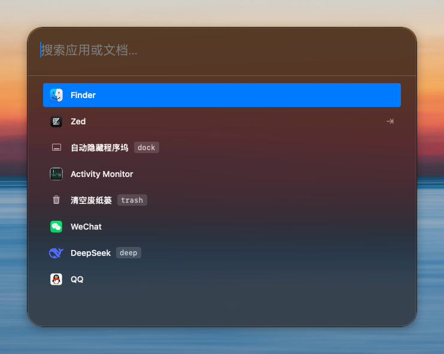

# LaunchX

一个现代、优雅且智能的 macOS 启动器。高性能的应用和文件搜索，丰富的扩展功能，让你的 Mac 使用效率翻倍。


## 功能特性

### 核心功能

- **应用搜索** - 快速搜索并启动应用程序，支持英文、拼音、拼音缩写搜索
- **文件搜索** - 高性能文件索引，实时监控文件变化
- **全局快捷键** - 自定义快捷键或双击修饰键快速唤起
- **IDE 项目** - 快速打开 VSCode、Zed、JetBrains 系列 IDE 的最近项目
- **网页直达** - 配置常用网站，一键跳转或快速搜索
- **最近使用** - LRU 算法智能追踪最近使用的应用

### 高级扩展

- **剪贴板管理** - 自动记录剪贴板历史（文本、图片、文件、链接、颜色）
- **代码片段 (Snippet)** - 文本自动替换，支持动态变量（日期、时间、UUID 等）
- **AI 翻译** - 集成多种 AI 服务进行智能翻译
- **书签搜索** - 从 Safari 和 Chrome 导入书签并快速搜索
- **2FA 验证码** - 从短信中自动提取验证码（macOS 26 以下版本）
- **系统命令** - 快速执行系统设置（深色模式、锁屏、关机等）
- **实用工具** - Base64 编码、IP 查询、URL 处理、UUID 生成等

## 截图



## 安装

### 系统要求

- macOS 13.0 或更高版本

### 下载安装

1. 从 [Releases](https://github.com/twotwoba/LaunchX/releases) 下载最新的 `.dmg` 文件
2. 打开 DMG 文件，将 LaunchX 拖入 Applications 文件夹
3. 首次启动时，按照引导授予必要权限

### 从源码编译

```bash
git clone https://github.com/twotwoba/LaunchX.git
cd LaunchX
open LaunchX.xcodeproj
```

在 Xcode 中选择你的开发团队，然后运行项目。

## 权限说明

LaunchX 需要以下系统权限才能正常工作：

| 权限 | 用途 |
|------|------|
| **辅助功能** | 全局快捷键注册、键盘事件监听、代码片段自动替换 |
| **完全磁盘访问** | 索引和搜索所有文件、读取浏览器书签 |

首次启动时会有权限引导流程，按照提示操作即可。

## 快速上手

### 基本使用

1. **唤起搜索框** - 按下 `Option + Space`（可自定义）
2. **搜索应用** - 输入应用名称，支持拼音搜索
3. **启动应用** - 按 `Enter` 打开选中的应用
4. **上下选择** - 使用 `↑` `↓` 箭头键选择结果

### 快捷键

| 快捷键 | 功能 |
|--------|------|
| `Option + Space` | 唤起主搜索面板（默认） |
| `Enter` | 打开选中项 |
| `↑` / `↓` | 上下选择 |
| `Tab` | 展开 IDE 项目列表 / 切换焦点 |
| `Esc` | 关闭面板 |
| `Cmd + ,` | 打开设置 |

### 扩展功能快捷键

在设置中可为各扩展功能配置独立快捷键：

- 剪贴板面板
- AI 翻译面板
- 书签搜索
- 2FA 验证码 (macOS 26用户无需此功能)

更多功能继续开发中...

## 配置

### 搜索范围

在设置中可自定义：

- **应用搜索范围** - 默认搜索 `/Applications`、`/System/Applications` 等
- **文档搜索范围** - 默认搜索下载、文档、桌面文件夹
- **排除文件夹** - 如 `node_modules`、`dist` 等
- **排除应用** - 隐藏不需要的应用

### IDE 支持

自动扫描以下 IDE 的最近项目：

- Visual Studio Code
- Zed
- IntelliJ IDEA
- PyCharm
- WebStorm
- GoLand

### AI 翻译配置

支持多种 AI 服务提供商：

- OpenAI (GPT)
- Anthropic (Claude)
- 阿里云通义千问
- 其他兼容 OpenAI API 的服务

在设置中配置 API 密钥和模型即可使用。

## 技术架构

- **搜索引擎** - 基于 Trie 前缀树的高性能内存索引，搜索响应 < 1ms
- **文件监控** - 使用 FSEvents 实时监控文件变化
- **混合架构** - AppKit + SwiftUI，兼顾性能与现代 UI
- **数据持久化** - SQLite 索引数据库 + JSON 配置文件

## 更新日志

查看 [CHANGELOG.md](CHANGELOG.md) 了解完整更新历史。

## 开发

### 技术栈

- Swift 5.9
- SwiftUI + AppKit
- SQLite3
- Carbon Framework (全局快捷键)

### 项目结构

```
LaunchX/
├── App/                    # 应用入口和面板
├── Models/                 # 数据模型
├── Services/               # 业务逻辑服务
│   └── SearchEngine/       # 搜索引擎核心
├── ViewModels/             # 视图模型
├── Views/                  # UI 视图
└── Assets.xcassets/        # 资源文件
```

## 贡献

欢迎提交 Issue 和 Pull Request！

## 许可证

[Apache License 2.0](LICENSE)

## 致谢

感谢所有为这个项目提供灵感和帮助的开源项目。
